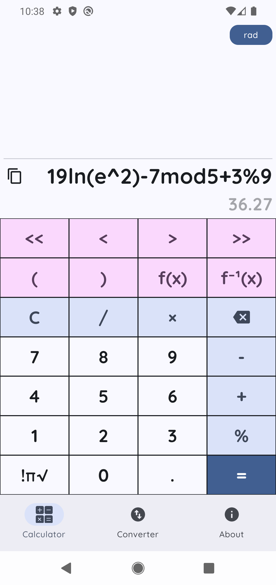
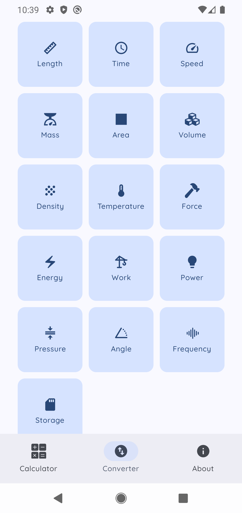
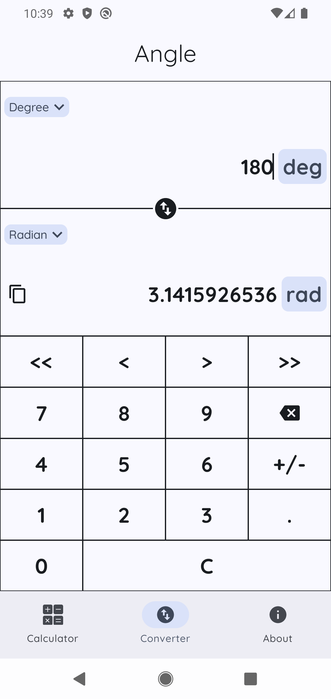

# Simple Calculator
A simple all-in-one calculator and unit converter for Android.
 
 

 
 

    
    
    

---

## Key Features

### Scientific functions
Perform trigonometric, logarithms, exponents, and roots functions with ease.
The interface is designed for speed, allowing you to edit calculations on the fly and view history instantly.

### Real-Time Unit Conversion
Experience **_live conversion_** that updates results as you type. No need to press an "equals" button.
With support for **_Metric_** and **_Imperial_** systems, you can effortlessly convert between units like kilometres to miles, Celsius to Fahrenheit, or kilograms to pounds.

### Offline functionality
Everything is offline.

### No Clutter, No Hassle
Unlike bloated alternatives, our app focuses on what matters only. No permission, no ad, just **_speed and simplicity_**.

### Coming Soon: Arbitrary Precision
Tired of rounding errors? Our next update will introduce Arbitrary Precision Arithmetic, allowing you to calculate with numbers of virtually unlimited size and accuracy.
- Exact Results: Eliminate floating-point errors.

- Massive Scale: Perform operations on integers and decimals with hundreds of digits, limited only by your device's memory.

- Advanced Support: Arbitrary precision support for scientific functions and unit conversion.

- Performance: Optimized algorithms ensure that even complex calculations with hundreds of digits remain responsive.

---

## Technical Details

### Compatibility
Optimized for Android 6 and above.

### Privacy
No data is collected.

---

## Support
If you wish to support this project, you can do so by making a donation [here](https://cutt.ly/QysgjZJ6).

