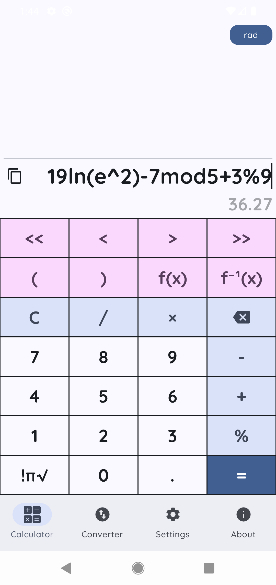
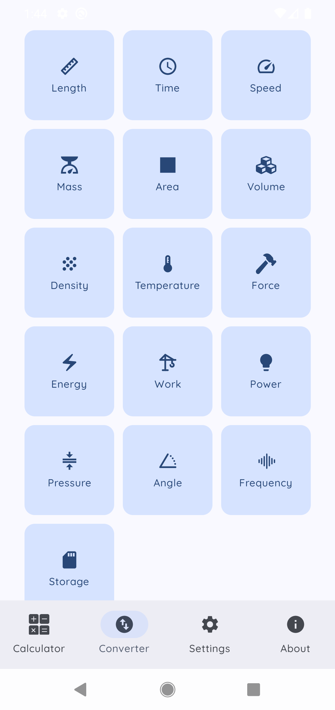
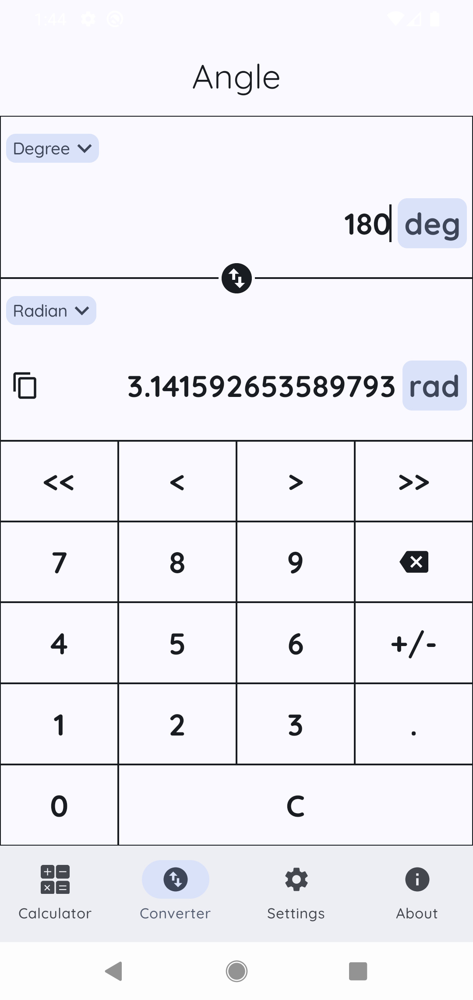

# Simple Calculator
A simple all-in-one calculator and unit converter for Android.
 
 

 
 

    
    
    

---

## Key Features

### Scientific functions
Perform trigonometric, logarithms, exponents, and roots functions with ease.
The interface is designed for speed, allowing you to edit calculations on the fly and view history instantly.

### Real-Time Unit Conversion
Experience **_live conversion_** that updates results as you type. No need to press an "equals" button.
With support for **_Metric_** and **_Imperial_** systems, you can effortlessly convert between units like kilometres to miles, Celsius to Fahrenheit, or kilograms to pounds.

### Arbitrary Precision
Calculate with as much accuracy as you want.

### Offline functionality
Everything is offline.

### No Clutter, No Hassle
Unlike bloated alternatives, our app focuses on what matters only. No permission, no ad, just **_speed and simplicity_**.

---

## Technical Details

### Compatibility
Optimized for Android 7 and above.

### Privacy
Your data are not collected.

---

## Contributing

### Reporting a bug & requesting a new feature
You can either report a bug or request a new feature by opening an issue.

### Submitting code
If you are contributing code, make your pull request to the branch named "**dev**".

---

## Support
If you wish to support this project, you can do so by making a donation [here](https://cutt.ly/QysgjZJ6).

